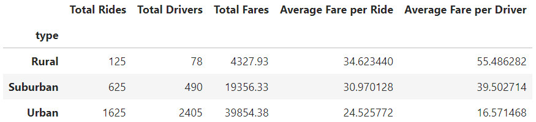
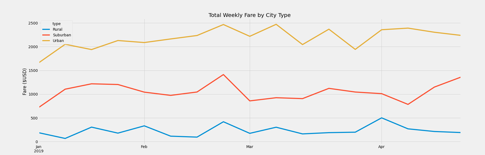

# Ride Sharing Analysis
Analysis of a ride sharing platform between different city types

## Overview
Perform exploratory data analysis to showcase relationships between the type of city and the number of riders as well as the percentage of total fares, riders and drivers by type of city. 

## Results
Based on the analysis that we competed, it shows that the number of riders is the greatest in urban cities. This also leads to a greater number of drivers as well as total fares. That being said the average fare is lower in the urban setting. As shown in the table below, we see that there is a strong correlation between Rural rides being more expensive compared to Urban, with suburban sitting right between the two.

In the graph below we see that the sheer amount of fares collected in an urban setting is far outnumbering those in the rural areas. Based on the weekly graph we see that there most definitely is a consistent relationship between the rides in the urban setting vs the rural setting.

## Summary 

There are many things that can be done to improve profits based on the data above. 
1. As rural rides are not as common, there can be an attempt to reduce the number rural drivers, as that could reduce overhead, and greatly increase an already high fare per driver. The data shows that rural riders are riding a longer distance, but due to the lower number of rides in total, I cannot recommend increasing the number of drivers in that area.

2. The urban landscape may be the best way to increase the amount of profit. With a larger driver group in more urban areas, we could see an increase in the number of rides, leading to increased overall profit.

3. Although suburban ridership is a fraction of that seen in more urban areas, it can be a large center for growth. With both average fare, and average fare per driver squarely in between rural and urban we can see that it may be the best of both worlds. Increasing fares slightly in this region as well as the number of drivers could get suburban ridership almost as profitable as urban. 
